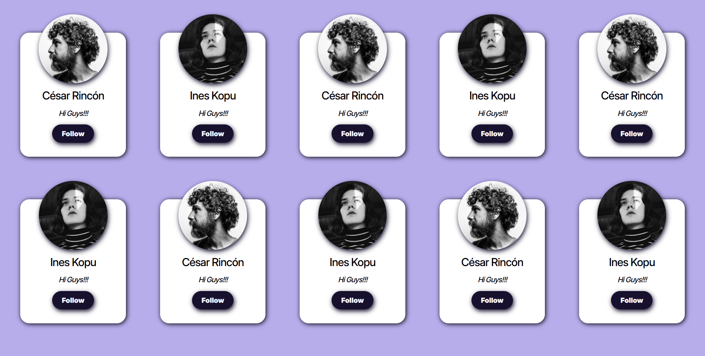

# 📐 Flex Layout Cards

A clean and modern **flexbox-based card layout** showcasing user profiles with images, names, messages, and interactive follow buttons.  
Built using **HTML** and **CSS**, this project demonstrates responsive flex layouts, hover effects, and card styling.

---

## ✨ Features

- 📱 Responsive flexbox layout with wrapping
- 🖼️ Profile cards with circular images
- 💬 User name, message, and **Follow** button inside cards
- 🌈 Soft shadows and rounded corners for modern aesthetics
- 🎨 Consistent color palette with hover effects on buttons
- 🧩 Scrollable container if cards exceed viewport height

---

## 🌐 Live Demo / Review


You can view and interact with the project online here:  
👉 [Live Demo](https://YOUR-LIVE-DEMO-LINK/)

Explore the **[project highlight]** directly in your browser.

---

## 🗂️ File Structure

```
Flex-Layout-TASK5/
│
├── index.html # Main HTML file for card layout
├── style.css # CSS styling for flex layout, cards, and hover effects
│
├── /fonts/ # Custom font folder
│ └── Inter-VariableFont_opsz,wght.woff2
│
├── /favicon/ # Website icons and manifest
│ ├── favicon-16x16.png
│ ├── favicon-32x32.png
│ ├── apple-touch-icon.png
│ └── site.webmanifest
│
├── README.md # Project documentation
│
└── preview.webp # preview image of page
```

---

## 💻 Usage

1. **Clone the repository:**
   ```bash
   git clone https://github.com/harsh-codes-hub/Flex-Layout-TASK5.git
   ```
2. **Navigate to the project directory:**

   ```bash
   cd Flex-Layout-TASK5
   ```

3. **Open the project in your browser**
   ```
   open index.html
   ```
   or simply double-click on **index.html**

---

## 🧠 Learning Highlights

- Practiced flexbox layouts and wrapping
- Styled profile cards with circular images and shadows
- Implemented hover effects on buttons
- Learned to build scrollable containers with hidden overflow
- Applied a clean, consistent color palette and font styling

---

## 📸 Preview

A responsive flexbox card layout showcasing user profiles with hoverable Follow buttons and circular profile images.



---

## 🛠️ Built With

- HTML5
- CSS3
- Flexbox
- Custom Font: Inter Variable Font

---

## 👨‍💻 Author

**Cohort 2.0 – Batch Task 5 Submission**  
Created by **Harsh Gajrani** _(Harsh Codes Hub)_  
Part of the **Cohort 2.0 batch at Sheryians Coding School**

---

_⭐ If you found this project helpful or inspiring, please consider giving it a star on GitHub!_
